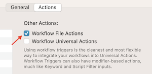
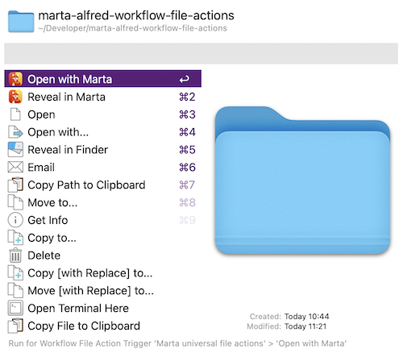

# Marta universal file actions 🦊 ❤️ 🎩
**Open and reveal folders and files with Marta**

## Instructions
[Marta](https://marta.sh/) 🦊 is a great file manager for MacOS. [Alfred](https://www.alfredapp.com/) 🎩 is the perfect tool to increase your productivity on the Mac. This small Alfred workflow allows you to open and reveal folders and files directly in Marta using Alfred's universal actions.

## Setup ⚒️
Installation is simple:
1. Download the workflow
2. Double-click the workflow to install it
3. In Alfred, under *Universal action*/*Actions*, check *Workflow file actions* under *Other Actions*

## Usage 🧑‍💻
Just use the Alfred universal action. Two new actions will be available: *Open in Marta* and *Reveal in Marta*.

